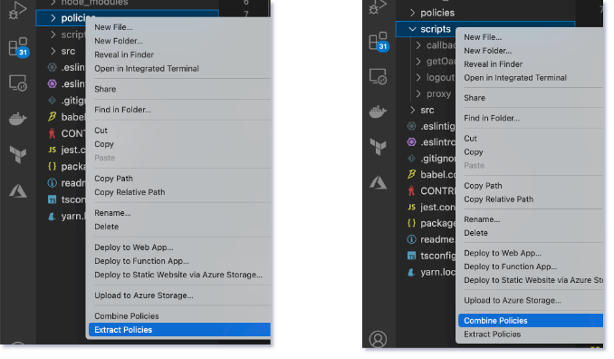
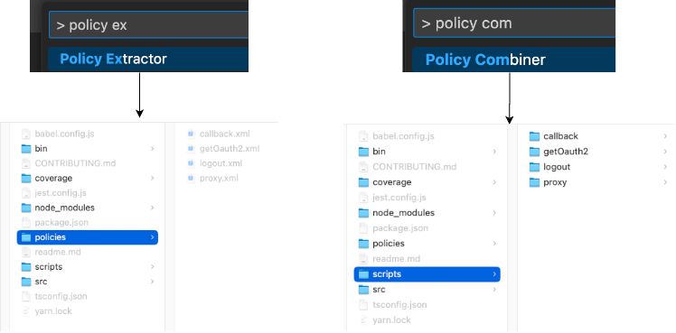

# 🚀 APIM Policy Transformer Extension for Visual Studio Code

<p align="center">
  
</p>

The APIM Policy Transformer Extension for Visual Studio Code provides a quick and easy way to extract and combine Azure API Management (APIM) policies directly within the editor.

## 🔧 Installation
You can install the extension directly from the Visual Studio Code marketplace.

## 📦 Features
The extension provides two commands:

1. Extract Policies - Extract inline policies and policy sets from `xml` files in a directory and generates `csx` files for each policy.

2. Combine Policies - Combine the extracted `csx` files from subdirectories of a given directory into a single `xml` file.

## 📝 Usage
### Using the Right-Click Menu
To use the extension, simply right-click on a folder in the Explorer view and select either Extract Policies or Combine Policies from the context menu.




### Using the Command Palette
You can also use the VS Code command palette to run the "Extract Policies" or "Combine Policies" command.

Open the Command Palette by pressing Ctrl+Shift+P (Windows, Linux) or Cmd+Shift+P (macOS).

Type `Policy Combiner` or `Policy Extractor` and select the appropriate command from the list.




## 📂 Folder Structure
### Extract Policies
Please use a directory path that contains all the policy files. The directory structure should look like this:

```
.
├── policies
|   ├── policy1.xml
|   ├── policy2.xml
|   └── policy3.xml
```

### Combine Policies
Please use a directory path that contains subdirectories with generated `.csx` files from the `Extract Policies` command. The directory structure should look like this:

```
.
├── scripts
|   ├── subfolder1
|   |   ├── block-001.csx
|   |   ├── inline-001.csx
|   |   ├── replaced.xml
|   |   ├── context.csx
|   |   └── context.json
|   ├── subfolder2
|   |   ├── block-001.csx
|   |   ├── inline-001.csx
|   |   ├── replaced.xml
|   |   ├── context.csx
|   |   └── context.json
```


## 📜 License
This project is licensed under the MIT License.